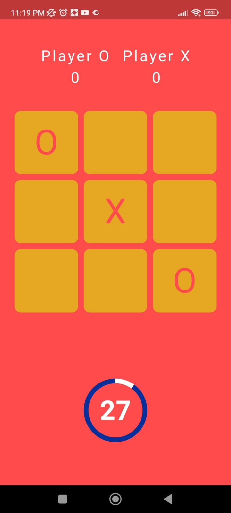
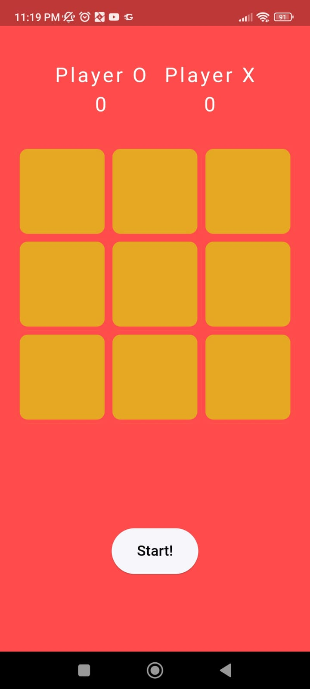
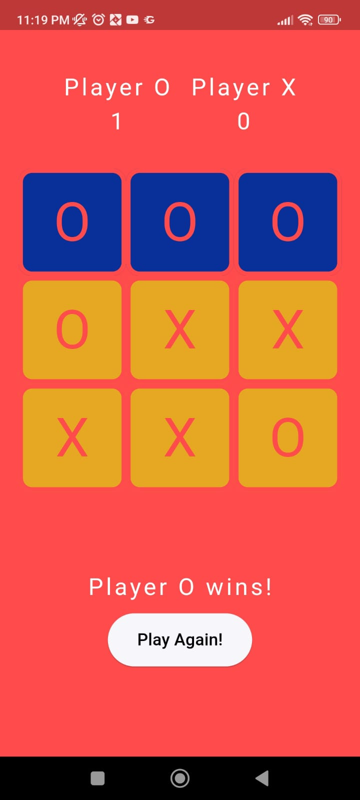

# Tic Tac Toe 

This is a simple Tic Tac Toe game project, made in Flutter.

# Screenshots

# Prerequisites

1- Have an Android device.

2- Have atleast 10Mb available storage.

# Installation
1- Navigate to the release folder.

2- Download the apk according to your device architecture.

3- Install the apk on your device.

4- Enjoy!

# Built with <a href= "https://flutter.dev/">Flutter</a>

